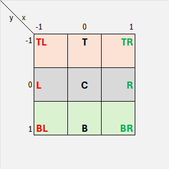
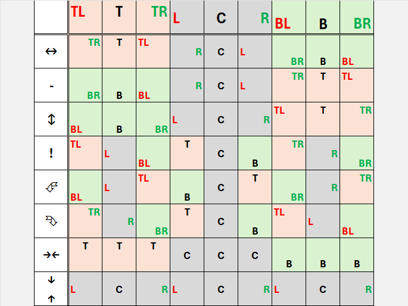
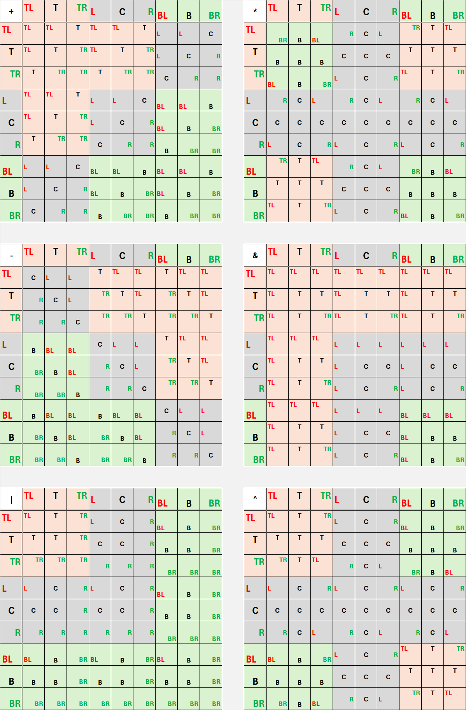

# Balanced Directions

**Balanced Directions** is a Rust crate for modeling directions and movements in a 3x3 grid using a balanced
ternary-inspired logic. **It can be viewed as a 2D ternary digit.**

It provides tools to manipulate positions, paths, and directions on a grid-based structure,
making it useful in scenarios requiring discrete grid movement, coordinated navigation, or 2D spatial logic.

## Features

- **Enum Representation (`Balance`)**:  
  Represents positions in a 3x3 grid with easy access to their 2D vector representation.
- **Grid Navigation**:  
  Convenient methods for grid-based movement operations (`up`, `down`, `left`, `right`) as well as rotations, flips, and
  vector transformations.
- **Path Manipulation**:  
  A `Path` structure for modeling sequences of movements, offering utilities to normalize, reverse, and transform paths.
- **Ternary Integration (Optional)**:  
  Balanced-ternary-based coordinates when integrating with the `balanced-ternary` crate.
- **`#![no_std]` Compatibility**:  
  A lightweight design for use in embedded or low-level systems.

## Examples

### Position Representation and Movement

The core `Balance` enum represents positions in a 3x3 grid. For example, you can easily identify positions such as
`TopLeft` or `Center`. Use movement methods to perform grid operations.

```rust
use balanced_directions::Balance;

fn example_usage() {
    let position = Balance::TopLeft;
    assert_eq!(position.to_vector(), (-1, -1));

    let moved = position.right();
    assert_eq!(moved, Balance::Top);

    let rotated = moved.rotate_left();
    assert_eq!(rotated, Balance::Left);
}
```

### Path Representation and Manipulation

The `Path` structure enables you to work with sequences of grid movements.

```rust
use balanced_directions::{Balance, Path};

fn path_example() {
    let movements = vec![Balance::Top, Balance::Right, Balance::Bottom];
    let path = Path::new(movements);

    assert_eq!(path.len(), 3);
    assert_eq!(path.to_vector(), (1, 0)); // Cumulative movement: right by 1

    let normalized_path = path.normalized();
    assert_eq!(normalized_path.to_vector(), (1, 0)); // Same result after normalization
}
```

### Integration with Balanced Ternary

With the feature `"ternary"`, you can convert grid positions to and from balanced ternary representations.

```rust
use balanced_directions::Balance;
use balanced_ternary::Digit;

fn ternary_example() {
    let position = Balance::Top;
    let ternary_pair = position.to_ternary_pair();
    assert_eq!(ternary_pair, (Digit::Zero, Digit::Neg)); // Top is represented as (0, -1)

    let recreated_position = Balance::from_ternary_pair(Digit::Zero, Digit::Neg);
    assert_eq!(recreated_position, Balance::Top);
}
```

## API Overview

### `Balance`

| The `Balance` enum<br>represents nine positions<br>of a 3x3 grid | As a 2D ternary digit<br>its cases can be viewed as `False`/`Unknown`/`True`<br>on 2 dimensions |
|------------------------------------------------------------------|-------------------------------------------------------------------------------------------------|
|                                           |                                                              |

`Balance` enum cases:

- `TopLeft`, `Top`, `TopRight`
- `Left`, `Center`, `Right`
- `BottomLeft`, `Bottom`, `BottomRight`

#### Operations:

A lot of operation can be performed with one (unary operations) or two (binary operations) `Balance`(s).

Below, the operation table of all **Balance operations**.

##### Unary directions

Moves with bounds (`up`, `right`, `down`, `left`) or wraps around (`up_wrap`, `right_wrap`, `down_wrap`, `left_wrap`).


##### Unary operations

Performs some useful transformations on a `Balance` (`flip_h`, `neg`, `flip_v`, `not` (transpose), `rotate_left`, `rotate_right`,
`center_h`, `center_v`).



##### Binary operations

Combines two `Balance`s into one (`add`, `mul`, `sub`, `bitand`, `bitor`, `bitxor`).



### `Path`

A collection of `Balance` movements stored as steps in a sequence. Paths can be created, traversed, and normalized for
efficient representation of cumulative movement.

#### Key Methods:

- **Construction**: `new()`, `from_vector()`
- **Traversal**: `iter()`, `iter_mut()`
- **Transformation**:
  `normalized()`, `reversed()`, `each()`, `each_zip()`

## Cases

1. **Grid-based Movement in Games**
   Simulate and manipulate movements within 3x3 environments for character navigation, AI paths, or puzzle logic.
2. **Embedded Robotics Applications**
   Represent grid movements for sensor or actuator navigation without relying on the standard library.
3. **Spatial Modeling or Math-based Algorithms**
   Perform 2D spatial computations with a high-level abstraction for vector-based movements.

## Documentation

The complete API documentation is available on [docs.rs](https://docs.rs/balanced-direction). It contains details on
each type, method, and their use
cases.

## Related Libraries

- [`balanced-ternary`](https://crates.io/crates/balanced-ternary): Provides balanced ternary number manipulations used
  for optional integration.

## License

Copyright (c) 2025 [Sébastien GELDREICH](mailto:dev@trehinos.eu)  
`Balanced Direction` is licensed under the [MIT License](LICENSE).